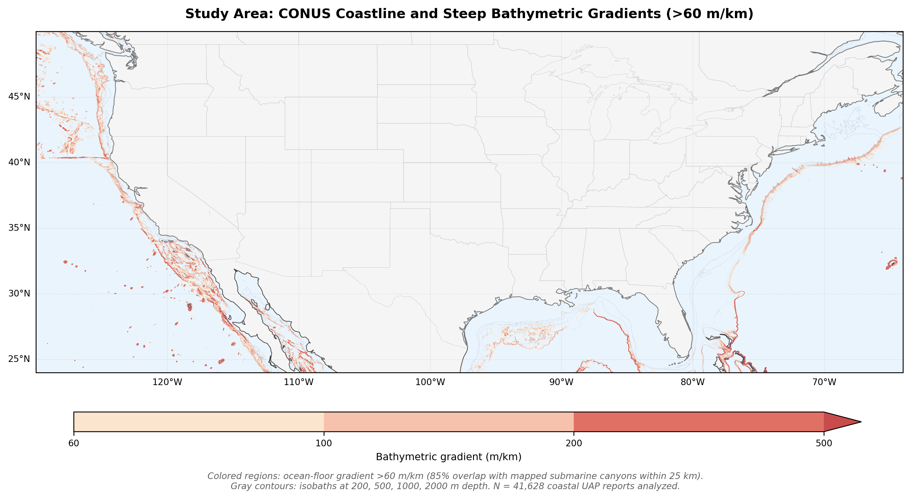
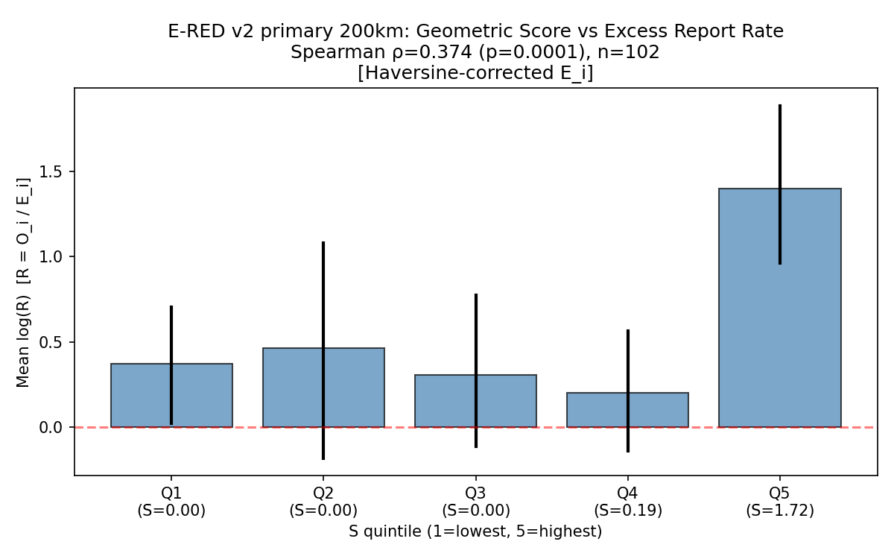
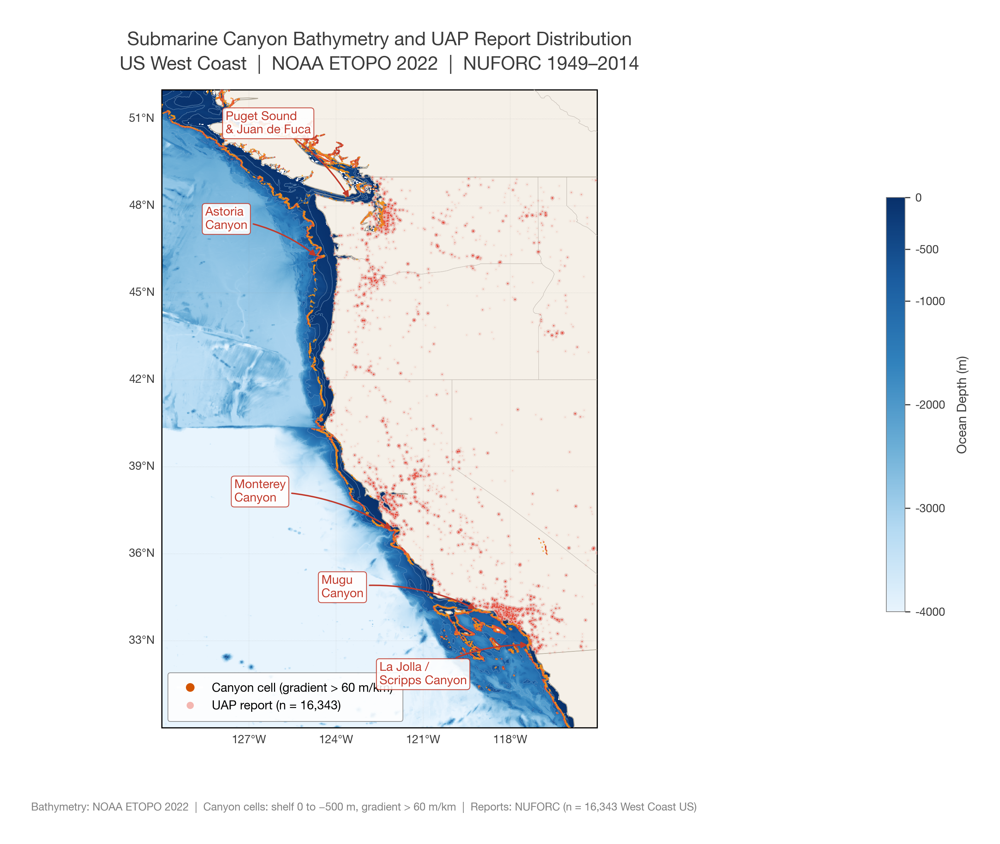
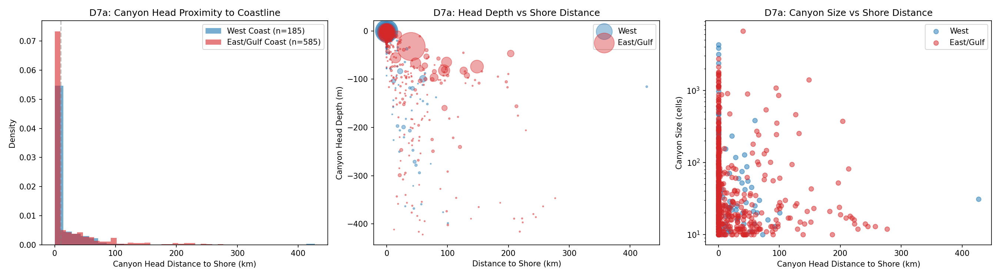
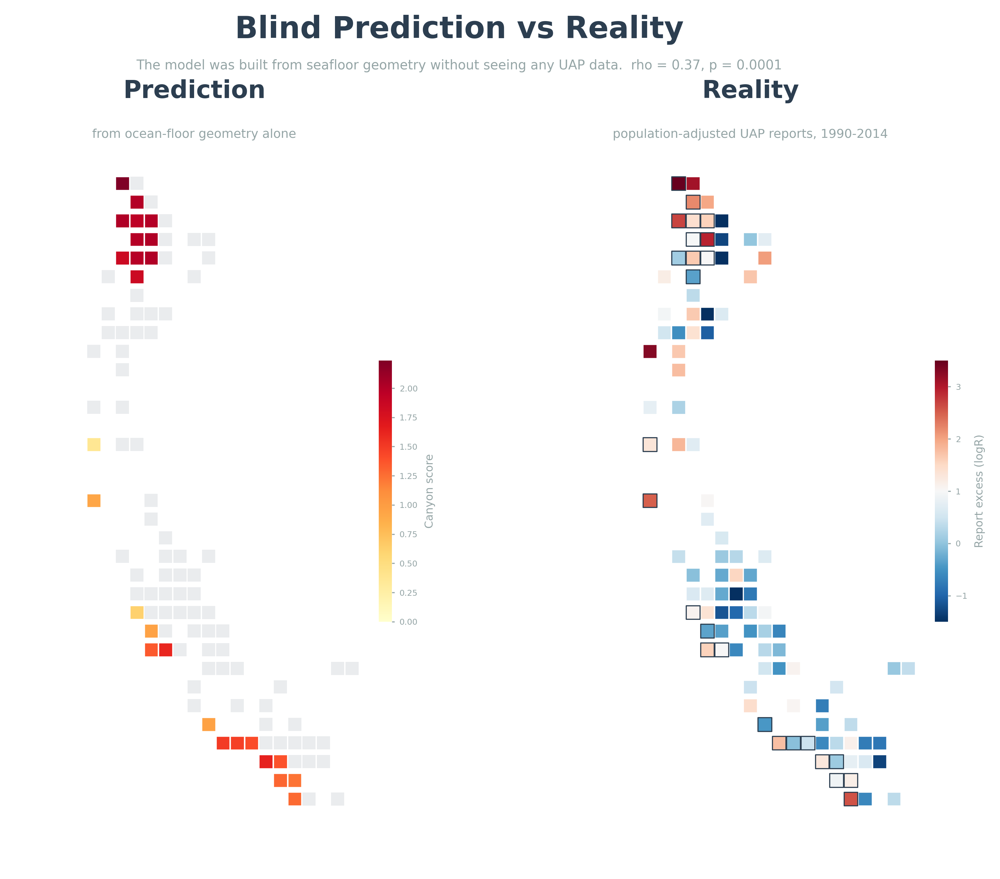

# Do UFO Sightings Cluster Near Underwater Canyons?

**A plain-language summary for non-scientists**

**Audio walkthrough:** [`UAPs_Cluster_Over_Steep_Underwater_Canyons.m4a`](media/UAPs_Cluster_Over_Steep_Underwater_Canyons.m4a) (NotebookLM, ~20 min)

---

## The question

The ocean floor is not flat. In some places, massive underwater canyons cut into the continental shelf — some rivaling the Grand Canyon in scale. We asked: do UFO sightings happen more often near these features?

## What we did

We took 80,000+ UFO sighting reports from the National UFO Reporting Center (NUFORC, 1990-2014) and mapped them against detailed ocean floor data from NOAA. We controlled for the obvious explanations — population density (more people = more reports), military bases, ports, and Navy operating areas. We used standard statistical methods and made all code and data publicly available.

## What we found

Along the US West Coast, UFO sighting rates are significantly elevated near steep underwater canyons, even after accounting for population and military activity. The strongest effect appears in three regions:

- **Puget Sound** (Washington state): 6.8x more reports near canyon features than expected
- **San Diego**: 9.8x more reports near the Scripps/La Jolla canyon system
- **Monterey Bay**: 2.75–4.80x more reports near one of the world's largest submarine canyons

The statistical association (Spearman rho = 0.37, p = 0.0001) held up across every test we ran: different time periods, different canyon definitions, held-out data from 2014-2023, and multiple confound checks.

## What we did NOT find

The effect **does not appear** on the US East Coast. But this is likely a data limitation, not evidence against the hypothesis — East Coast canyons sit 100-400 km offshore (beyond the continental shelf edge), too far for land-based observers to report anything unusual above them. West Coast canyons, by contrast, come within 50 km of shore.

## Key figures

**Figure 1 — Where are submarine canyons?**

*Red dots = steep underwater canyon cells detected from NOAA ocean floor data. On the West Coast, canyons sit close to shore. On the East Coast, they are far offshore.*

**Figure 2 — The headline result**

*We split 102 West Coast grid cells into five groups by canyon proximity. The top group (Q5, strongest canyon signal) shows ~25x more reports than expected. Population-adjusted.*

**Figure 3 — Where the effect is strongest**

*Color = ocean depth. Orange/red dots = canyon cells. Faint red scatter = individual UFO reports. Notice how report clusters and canyon cells overlap in Puget Sound, Monterey Bay, and San Diego.*

**Figure 4 — West Coast vs East Coast**

*Green = statistically significant. The canyon-UFO association is robust on the West Coast but absent on the East Coast, where canyons are too far from shore.*

**Figure 5 — Why only the West Coast?**

*West Coast canyons (blue) are within 50 km of shore. East Coast canyons (red) are 100-400 km offshore — too far for anyone on land to see anything above them.*

**Figure 6 — Blind prediction vs reality**

*Left: what the model predicted from ocean-floor geometry alone (no UAP data). Right: actual population-adjusted UAP report excess. The pattern matches. Black outlines on right panel mark canyon cells.*

**Figure 7 — Robustness scorecard**

*9 hostile tests. 7 passed. 1 honest limitation (regional concentration). 1 null control (East Coast) behaves as expected.*

## How strong is the evidence?

- **It's not uniform** — the effect is strongest in Puget Sound (6.8x) and San Diego (9.8x), with an intermediate signal at Monterey Bay (2.75–4.80x). The remaining West Coast cells average 1.4x. Importantly, non-canyon cells *in those same regions* report *below* baseline — the uplift is canyon-specific, not "Seattle has lots of people."
- **Monterey Bay: the natural experiment** — Monterey Canyon is one of the world's largest submarine canyons. It has intermediate steepness (S = 1.3–1.6) and shows intermediate uplift (2.75–4.80x) — exactly what a real physical association predicts. Its canyon cells sit 127–192 km from the nearest Navy operating area, ruling out military activity. Non-canyon cells in the same region report at baseline. This one location combines dose-response, military elimination, and canyon-specific uplift into a single test case.
- **Stable across 25 years** — the association holds in 1990–2002 and 2003–2014 separately, and in 21 out of 21 rolling 5-year windows. It's not driven by a single event.
- **Predicted before testing** — the model was built using only ocean floor geometry, without looking at any UFO data. It then correctly predicted 4 out of 5 top hotspot locations.
- **Replicated in unseen data** — post-2014 reports (not used in any part of model development) show the same association (rho = 0.35, p = 0.0001).
- **Not a line-of-sight effect** — the signal peaks at 50 km from shore, not at the water's edge (10 km). This suggests something broader than "people on beaches see things over the ocean."

## "But isn't it just population?"

This is the first question everyone asks, and we tested it extensively:

- **Report rates are population-adjusted** — we don't count raw sightings, we measure whether an area has *more* sightings than its population would predict
- **The killer test**: In Puget Sound (Seattle metro area), grid cells *without* canyon features have *fewer* reports than expected (0.74x). Canyon cells in the same region have 5x more. If this were just "big city = more reports," both would be elevated. Only the canyon cells are.
- **Military activity**: We controlled for 171 military bases and 35 Navy offshore operating areas. The canyon effect survives. Monterey Bay canyon cells are 127–192 km from the nearest Navy zone and still show elevated rates.
- **Ports and marine traffic**: Controlled for 7,747 ports and marinas. Survives.
- **Coastal geography**: Tested whether coastline shape (cliffs, complexity) explains the pattern. Canyon steepness adds predictive power beyond coastal shape alone.
- **Ocean currents / upwelling**: Tested directly using satellite chlorophyll-a data (NASA MODIS). Upwelling is uncorrelated with canyon steepness and does not explain the association.
- **Threshold choice**: The canyon detection threshold (60 m/km gradient) was not cherry-picked — sweeping all thresholds from 20 to 100 m/km shows the association is significant at every value tested.
- **Overfitting**: The scoring model was frozen before seeing any UFO data — it uses only ocean floor geometry. It correctly predicted 4 out of 5 top hotspot cells in held-out regions, and replicated in fully independent post-2014 data not used during development.

## What this means

This is a correlation, not an explanation. We do not know *why* sightings cluster near underwater canyons. Possible interpretations range from atmospheric effects caused by deep-water upwelling, to observer biases we haven't identified, to something genuinely anomalous. The finding is robust enough to warrant independent replication and further investigation.

## Key numbers

| Metric | Value |
|--------|-------|
| Total reports analyzed | 80,332 |
| West Coast grid cells tested | 102 |
| Primary correlation | rho = 0.37, p = 0.0001 |
| Out-of-sample replication (post-2014 data) | rho = 0.35, p = 0.0001 |
| Confounds tested and survived | population, military, ports, ocean depth, magnetic anomaly, coastal upwelling, Navy operating areas |

## Limitations and honest uncertainties

- **Regional, not global** — the effect is detected only on the US West Coast. It is not detected on the East Coast, though this may be a data limitation (canyons too far from shore) rather than evidence against the hypothesis
- **Concentrated** — Puget Sound, San Diego, and Monterey Bay drive most of the signal. The remaining West Coast cells average only 1.4x uplift. All three strong regions have canyons unusually close to shore
- **Self-reported data** — NUFORC is a voluntary reporting database. We cannot rule out unknown reporting biases correlated with coastal geography
- **Single-author, pre-peer-review** — this analysis has not been independently replicated or published in a peer-reviewed journal
- **No causal mechanism** — we show a spatial correlation, not an explanation. We do not claim to know *why* this pattern exists
- **Norway inconclusive** — an attempted replication on Norwegian fjords failed after population control. Norway's entire coastline is fjords, leaving no flat-shelf contrast group to test against

## What would strengthen or weaken this finding

- **Independent replication** in countries with near-shore canyons and independent UAP/UFO databases (Japan, Chile, Portugal, Mediterranean) would be the strongest test
- **Hydrophone or sonar data** from NOAA or navy acoustic monitoring networks near canyon systems could test whether there is any anomalous underwater acoustic activity correlated with surface reports
- **Improved population models** using nighttime lights (VIIRS) or mobile phone density data instead of county-level census would reduce uncertainty in the population adjustment
- **Temporal correlation** with oceanographic events (internal waves, upwelling episodes) could test physical mechanisms
- If independent replications consistently fail, or if a confound is identified that explains the Puget/Monterey/San Diego concentration, the finding should be downgraded or retracted

## How to verify

Everything is open-source. Clone the repository, install Python dependencies, download one bathymetry file from NOAA, and run two scripts. The headline result reproduces in under 5 minutes. See the [Quick Start](README.md#quick-start) section in the README.

---

**Author:** Antoni Wędzikowski — independent researcher, lawyer and legaltech founder, Warsaw, Poland
**Repository:** [github.com/antoniwedzikowski-rgb/uap-canyon-analysis](https://github.com/antoniwedzikowski-rgb/uap-canyon-analysis)
**Contact:** [LinkedIn](https://www.linkedin.com/in/antekwedzikowski/) · GitHub Issues
